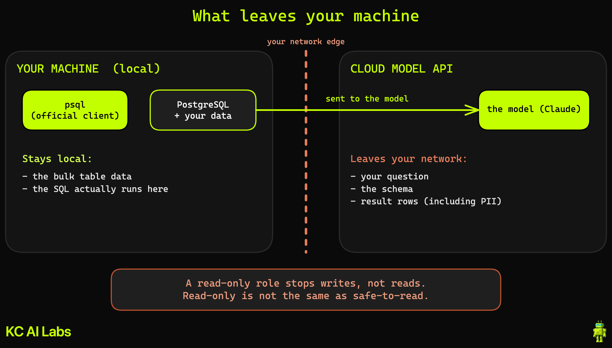

# Claude Code + PostgreSQL: query your database in plain English, safely

Point [Claude Code](https://www.anthropic.com/claude-code) at a real PostgreSQL database, ask questions in plain English, and read the answers, without ever giving the agent the power to change a single row. The safe version of this comes down to three habits:

1. **Create a read-only role first** so the agent physically cannot write, drop, or delete. The database enforces it, not the model's good behavior.
2. **Read the SQL it writes before it runs.** A strong model rarely produces broken SQL; the quieter failure is correct SQL that answers the wrong question.
3. **Be honest about what leaves your machine.** The SQL runs locally, but your question, the schema, and the result rows (including any PII) go to the model API.

This repo is the companion to the video. It gives you a small sample database, the exact read-only role commands, and the prompts to try, so you can reproduce the whole thing in a few minutes.

> Channel: [Kyle Chalmers Data Plus AI](https://www.youtube.com/@kylechalmersdataai)

## How it connects (official-first)

`psql` is PostgreSQL's official, first-party command-line client. It ships with Postgres, so there is nothing third-party between Claude Code and your database. That is the path this repo uses, and the one to reach for.

You will also hear about MCP servers. Worth knowing: **there is no official Postgres MCP server.** Anthropic published a reference one, but reference servers are teaching examples, not production tools, and it is archived (it is also the subject of a [documented SQL-injection](https://securitylabs.datadoghq.com/articles/mcp-vulnerability-case-study-SQL-injection-in-the-postgresql-mcp-server/)). Every usable option today is community or vendor ([Postgres MCP Pro](https://github.com/crystaldba/postgres-mcp), pgEdge, Supabase, Neon). They are reasonable if you want structured tooling, just go in knowing you are trusting and maintaining a third-party server, and that whichever way you connect, **the read-only database role is the thing that actually protects you.**



## Prerequisites

| Tool | Why | Install |
|------|-----|---------|
| Docker | Runs the local Postgres in one command | https://docs.docker.com/get-docker/ |
| `psql` (PostgreSQL client) | The official client Claude Code shells out to | `brew install libpq` (macOS) or your package manager |
| Claude Code | The agent that writes and runs the SQL | https://www.anthropic.com/claude-code |

No cloud account, no production database. Everything here is local and disposable.

## Setup

**1. Start Postgres with the sample schema loaded:**

```bash
docker compose up -d
```

This runs `postgres:16-alpine` on `localhost:55432` and auto-loads [`sql/01_schema.sql`](./sql/01_schema.sql) (a small `shop` schema: `customers`, `products`, `orders`, `order_items`).

**2. Create the read-only role (do this yourself, as admin):**

Open [`sql/02_create_readonly_role.sql`](./sql/02_create_readonly_role.sql), set your own password where marked, then run it:

```bash
psql -h localhost -p 55432 -U postgres -f sql/02_create_readonly_role.sql   # password: demo
```

Creating this role is the highest-impact step, and you set the password, not the agent. Keep secrets out of the model's hands.

**3. Prove it's read-only:**

```bash
PGPASSWORD='<the password you set>' psql -h localhost -p 55432 -U analyst_ro -d postgres \
  -c "DROP TABLE shop.orders;"            # -> ERROR: must be owner of table orders
```

A `DROP` is refused (`must be owner`), an `UPDATE` is refused (`permission denied`), and a `SELECT` works. The destructive part is gone.

**4. Point Claude Code at it as the read-only role.** Connect with `psql` through Bash using the `analyst_ro` login (keep the password in `~/.pgpass` at `chmod 0600` so it never lands in your shell history). Then ask in plain English.

> Want to check the whole thing end to end first? Run `bash scripts/validate.sh` — it stands up a throwaway Postgres, creates the role, proves writes are blocked, and runs the demo queries.

## Prompts to try

Set one standing rule for the session first: *"Write the SQL, show it to me, wait for my OK, then run it."* Then:

- "How many orders did we get in May, and what's the total order value?"
- "Walk the `shop` schema. List the tables, their columns, and how they relate."
- "Which product category brought in the most revenue from completed orders?"
- "Who are our top 5 customers?" — read the SQL: "top" by *order count* and by *revenue* are two different people here. Correct SQL can still answer the wrong question. (The durable fix for that ambiguity is a [semantic layer](https://www.youtube.com/@kylechalmersdataai).)
- "Show me a few rows from the `customers` table." — those names and emails just went to the model API. A read-only role stops writes, not reads.

## What leaves your machine

`SELECT`-only protects against writes. It does nothing to stop sensitive rows being read into the model. Read-only is not the same as safe-to-read. Minimize what you send: aggregate first, use `LIMIT`, or query masked views / a reporting schema with no raw PII. The `orders.notes` column here is free text on purpose: if a row held attacker-planted text, an agent reading it could be steered by it (Simon Willison's ["lethal trifecta"](https://simonwillison.net/2025/Jun/16/the-lethal-trifecta/)).

This is for reading and analysis on a local or staging copy, not your live production database, and not where your whole team writes against it at once.

## Project structure

```
claude-code-postgres/
├── docker-compose.yml              # one-command local Postgres, auto-loads the schema
├── sql/
│   ├── 01_schema.sql               # the shop schema + sample data (PII + a notes column)
│   └── 02_create_readonly_role.sql # the read-only role (set your own password, run as admin)
├── scripts/
│   └── validate.sh                 # end-to-end check: role enforced + the demo queries
├── images/
│   └── egress-boundary.png         # what stays local vs what goes to the model API
├── .env.example                    # connection vars (no secrets)
└── README.md
```

## License

MIT
